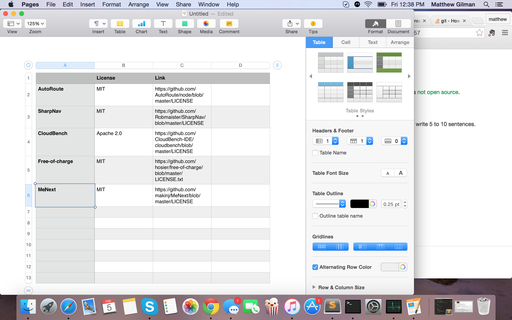

# Lab2.md

##### Why it is important to choose a LICENSE?

Something that does not have a license is not really an open source project. A lot of programmers will not help unless there is a license along with the open source project. Than you are sharing your work with everyone else and helping benefit not just yourself, but the entire community. The reason you choose a license is it complies with the OSI so that the software can be freely used, changed, and shared by anyone. The licenses protect those individuals from working on a project that they won't ever be able to use. 

##### Why they SHOULDN'T use a project that doesn't have a explicit license?

If there is no explicit License, than by definition "All rights resevered", which means anything you do cannot be used or distrubted(not really open source). Not helping community. Basically doing free work for an individual or company that you may not be able to share, or use for free. Helping others make a profit possibly with no help to the community or yourself really, which might bit you in the end. 

##### why Gopher failed and HTTP survived - Do you agree with this claim?

It is interesting, since at the time HTTP was picked, but now we are turning more towards the Gopher system. I agree with this claim, since a lot of things have changed since those were created. At the time it was probably more convenient and easier to do things through HTTP, since a there was not as many programmers back than and they probably wouldn't know what to do. Now with so many more programmers the authors of the sites can post files and create new menu files and fixing outdated links. I agree with the claim. 

##### Look at Software project and Justify why they used a certain license. 

This is the project I looked at, Canadaduane/house. They have a MIT License. This license is used, since it is extremely open and has little to no restrictions. Gives the coders helping with the project more access and reason to assist in this project. Only requirement an MIT license places on its recipients is that they keep original coders copyright notice intact when they repurpose, redistribute, or otherwise reuse original persons code. You can build a business that sells larger, proprietary applications built out of smaller, open source components without the fear of imitators purchasing and re-selling your product. 

##### GPL

The GNU General Public License (GNU GPL or GPL) is a widely used free software license, which guarantees end users (individuals, organizations, companies) the freedoms to run, study, share (copy), and modify the software.

##### LGPL

The LGPL is similar to the GPL, but is more designed for software libraries where you want to allow non-GPL applications to link to your library and utilise it. If you modify the software, you still have to give back the source code, but you are allowed to link it with proprietary stuff without giving the source code to all of that back.

##### BSD

Very Permissive. 
The BSD basically says "here's the source code, do whatever you want with it, but if you have problems, it's your problem". That means you can take BSD'ed code and turn it into a proprietary application if you so wish - there's nothing saying you have to give the code back (although it is nice to do so).

###### Developers

Depending on if the developers are trying to make a profit or just help out will make a difference when choosing the best license. I believe a developer looking for a profit would choose a BSD license. If the developer was doing it for fun or to help out, I believe he would use a LGPL license. This would enable the developer to use his own libraries and utilities which would be a huge bonus for them.  

###### Companies

I would choose a BSD license if I was a company, since you do not have to share the changes you make and you can redistribute as you wish. Very good for proprietary applications, which allows the company to be able to sell and redistribute this as they wish. They don't have to share their secrets with anyone else. 

###### Common Good

Common good I believe the best license would be GPL, since you share, change and redistribute everything. Less restrictions on this license, and you must give back all of the code you used or changed. 

##### Table for projects and licenses

##### Choose a project to work in this course and who will be users/customers and what license will you choose.

The project I would like to work on in this course is called the Butter Project. This caters to any movie and tv watchers around the world. It is similar to an older application popcorn time. The users and creaters are developers who are most likely movie enthusiasts. The license used is GPU. This would be an interesting project that many who love movies would benefit from. 
